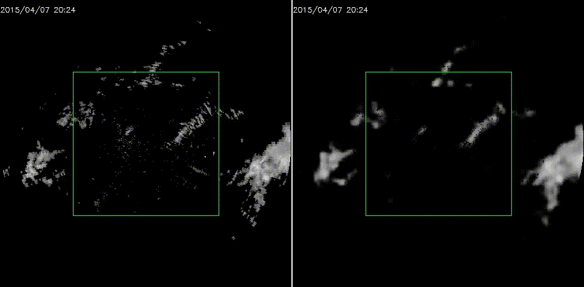

### Introduction
This repo has implemented a pytorch-based encoder-forecaster model with RNNs including (TrajGRU, ConvLSTM) to do precipitation nowcasting. For more information about TrajGRU, please refer to [HKO-7](https://github.com/sxjscience/HKO-7).

If you are interested in my implementation of ConvLSTM and TrajGRU, please see [ConvLSTM](https://github.com/Hzzone/Precipitation-Nowcasting/blob/master/nowcasting/models/convLSTM.py) and [TrajGRU](https://github.com/Hzzone/Precipitation-Nowcasting/blob/master/nowcasting/models/trajGRU.py). It is assumed that the input shape should be . All of my implementation have been proved to be effective in HKO-7 Dataset. Hopefully it helps your research.

### Train
Firstly you should apply for HKO-7 Dataset from [HKO-7](https://github.com/sxjscience/HKO-7), and modify somelines in config.py to find the dataset path.
Secondly and last, run `python3 experiments/trajGRU_balanced_mse_mae/main.py`, and then run `python3 experiments/trajGRU_frame_weighted_mse/main.py` since I have finetuned the model on the basis of model trained in last step.

### Environment
Python 3.6+, PyTorch 1.0 and Ubuntu or macOS.

### Demo


### Performance
The performance on HKO-7 dataset is below.

<table>
	<tbody>
		<tr>
			<td colspan="5" align="center">CSI</td>
			<td colspan="5" align="center">HSS</td>
			<td align="center">Balanced MSE</td>
			<td align="center">Balanced MAE</td>
		</tr>
		<tr>
			<td  align="center"></td>
			<td align="center"></td>
			<td align="center"></td>
			<td align="center"></td>
			<td align="center"></td>
			<td align="center"></td>
			<td align="center"></td>
			<td align="center"></td>
			<td align="center"></td>
			<td align="center"></td>
			<td align="center"></td>
			<td align="center"></td>
		</tr>
		<tr>
			<td align="center">0.5496</td>
			<td align="center">0.4772</td>
			<td align="center">0.3774</td>
			<td align="center">0.2863</td>
			<td align="center">0.1794</td>
			<td align="center">0.6713</td>
			<td align="center">0.6150</td>
			<td align="center">0.5226</td>
			<td align="center">0.4253</td>
			<td align="center">0.2919</td>
			<td align="center">5860.97</td>
			<td align="center">15062.46</td>
		</tr>
	</tbody>
</table>

### Download

[Dropbox Pretrained Model](https://www.dropbox.com/sh/i5goltdq83dmkvc/AABBe5wTuEQF5j3VSMszVQSaa?dl=0)

### Citation

```
@inproceedings{xingjian2017deep,
    title={Deep learning for precipitation nowcasting: a benchmark and a new model},
    author={Shi, Xingjian and Gao, Zhihan and Lausen, Leonard and Wang, Hao and Yeung, Dit-Yan and Wong, Wai-kin and Woo, Wang-chun},
    booktitle={Advances in Neural Information Processing Systems},
    year={2017}
}
@inproceedings{xingjian2015convolutional,
  title={Convolutional LSTM network: A machine learning approach for precipitation nowcasting},
  author={Xingjian, SHI and Chen, Zhourong and Wang, Hao and Yeung, Dit-Yan and Wong, Wai-Kin and Woo, Wang-chun},
  booktitle={Advances in neural information processing systems},
  pages={802--810},
  year={2015}
}
```

